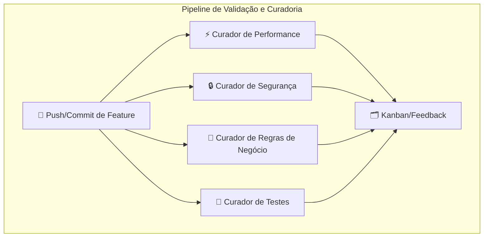

# 🧩 Project Manager — Plataforma de Orquestração, Automação e IA


---

## ✨ Visão Geral

O **Project Manager** é uma plataforma inovadora que une o poder de uma IDE visual, gestão de projetos, automação de tarefas e colaboração com múltiplas IAs, tudo em uma única interface moderna, flexível e extensível. Inspirado em ambientes como GNOME Desktop, VSCode e ferramentas de automação, o objetivo é criar uma "mesa de trabalho" digital para arquitetos de software, equipes técnicas e agentes de IA.

---

## 🖼️ Design Visual e Experiência do Usuário

O client do Project Manager adota um **design de janelas (windows) inspirado em IDEs modernas**, com foco em clareza, harmonia visual e usabilidade. Cada janela é um componente plugável, com controles, ícones, temas e acessibilidade configuráveis.


- 🧩 **Componentização total:** Cada janela (ex: 💬 Chat, 📋 Kanban, 📝 Editor) é um slice visual independente, fácil de estender e customizar.
- 🎨 **Design System:** Tokens de cor, tipografia, ícones e temas centralizados, garantindo consistência e fácil manutenção.
- ♿ **Acessibilidade:** Controles, interações e navegação otimizados para todos os perfis de usuário.
- 🛠️ **Flexibilidade tecnológica:** O client pode evoluir para outras stacks visuais (ex: GTK, Electron, Tauri), mantendo o mesmo padrão de UX e componentização.

> **Exemplo acima:** Janela de chat com título, ícone, sombra e controles, demonstrando o padrão visual harmônico e moderno do client.

---

## 🏗️ Arquitetura Geral

```mermaid
flowchart TD
    subgraph CLIENT
        Console[🖥️ Console]
        Dashboard1[📊 Dashboard]
        Dashboard2[📊 Dashboard]
        Window1[🪟 Window]
        Window2[🪟 Window]
        Window3[🪟 Window]
        Window4[🪟 Window]
        Dashboard1 -->|Orquestra| Window1
        Dashboard1 --> Window2
        Dashboard2 --> Window3
        Dashboard2 --> Window4
        Console --> Dashboard1
        Console --> Dashboard2
    end
    subgraph SERVER
        Gateway[🌐 Gateway Server]
        Server[🖧 Server]
        Database[(🗄️ Database)]
        Filesystem[(💾 Linux Filesystem)]
        Daemon[🛎️ Daemon (read)]
        SmolAI[🤖 smol-ai (write)]
        Gateway <--> Server
        Server <--> Database
        Server <--> Filesystem
        Daemon --> Filesystem
        SmolAI --> Filesystem
    end
    Console <--> Gateway
```

---

## 🧩 Princípios Arquiteturais

### 🪓 Vertical Slice Architecture

- Cada feature (janela, dashboard, chat, etc.) é um **slice** independente, com lógica, endpoints, integrações, testes e documentação próprios.
- Slices são autossuficientes, fáceis de evoluir, testar, automatizar e escalar (inclusive como microserviços).
- Backend: `src/tools/[feature]`
- Frontend: componentes, hooks, contextos e providers organizados por feature.

### 🧭 Console/Mediator

- Camada central que orquestra todas as system calls entre UI, adapters, storage, agentes IA e microserviços.
- Nenhuma feature fala diretamente com storage, IA ou outros slices — tudo passa pelo Console.
- Permite roteamento dinâmico, circuit breaker, logging, cache, fallback e integração com múltiplos clusters, projetos e pipelines.

### 🤖 Providers e Adapters

- **Providers de IA:** Todos herdam de `AbstractAIProvider`, com tipagem forte, validação e fallback. Ex: OpenAI, DeepSeek, Perplexity, Ollama, etc.
- **Adapters de Persistência:** Contrato único (`AbstractStorageAdapter`) para persistência (localStorage, database, etc.), configurável globalmente.
- **Registry central:** Permite plugar/desplugar features, providers e adapters via configuração YAML/JSON.

---

## 🤖 Múltiplos Agentes IA e Pipelines



- Cada agente IA é um pipeline especializado (curador) que atua de forma autônoma e assíncrona sobre o código, arquitetura e processos do projeto.
- Feedback dos agentes é integrado ao Kanban do projeto, promovendo melhoria contínua.

---

## 🔁 Aprendizado Contínuo e Fine-tuning Automatizado

```mermaid
flowchart TD
    subgraph "Ciclo de Aprendizado Incremental"
        G[📊 Interações/Erros/Feedbacks]
        H[🦆 DuckDB]
        I[🛠️ Pipeline de Fine-tuning (ft-flow)]
        J[🧠 Modelos Versionados (Ollama)]
        G --> H
        H --> I
        I --> J
        J -->|Atualiza| AgentesIA[🤖 Agentes IA]
    end
```

- Cada agente registra interações, erros e feedbacks em DuckDB.
- O pipeline de fine-tuning extrai exemplos reais para re-treinar e refinar agentes, promovendo aprendizado incremental e adaptação contínua.

---

## 📈 Escalabilidade Granular e Microserviços

```mermaid
flowchart TD
    subgraph "Slices/Microserviços"
        S1[🗣️ TTS Slice]
        S2[🎤 ASR Slice]
        S3[📦 Model Management Slice]
        S4[🔑 Auth/IAM Slice]
    end
    subgraph "Orquestração"
        M[🧭 Console/Mediator]
    end
    M --> S1
    M --> S2
    M --> S3
    M --> S4
    S1 -.->|Escala Horizontal| S1b[🗣️ TTS Slice (replica)]
    S2 -.->|Escala Horizontal| S2b[🎤 ASR Slice (replica)]
```

- Cada slice pode ser extraído e escalado como microserviço independente, conforme a demanda.
- Console/Mediator centraliza o roteamento, tornando transparente para o frontend e para outros slices se a feature está rodando localmente ou como microserviço.

---

## 🛠️ Desenvolvimento Agnóstico de IDE

- Todo o pipeline pode ser executado via terminal, Docker ou web, sem dependência de IDEs.
- Ferramentas como [smol-ai/developer](https://github.com/smol-ai/developer) são usadas para automação de tasks, scaffolding e geração de código slice por slice, em paralelo.
- O lema é: **"Construir para construir"** — a própria plataforma é usada para evoluir, automatizar e refinar o ecossistema.

---

## 🌟 Benefícios e Diferenciais

- 🔌 **Plug & Play:** Adicionar/remover features, providers e agentes IA é simples e seguro.
- 📈 **Escalabilidade sob demanda:** Só escala o que precisa, quando precisa.
- 🔄 **Reutilização máxima:** Serviços transversais (IAM, logging, etc) são compartilhados por todo o ecossistema.
- 🧩 **Evolução independente:** Cada slice pode ser desenvolvido, testado, extraído ou escalado sem impactar o restante.
- 🤖 **Automação máxima:** Agentes IA atuam como membros ativos do time, promovendo qualidade, segurança e evolução contínua.
- 🧠 **IA-friendly:** Todo o fluxo é projetado para automação, integração e evolução incremental, tanto por humanos quanto por IAs.
- 🛠️ **Desenvolvimento agnóstico de IDE:** Pipeline pode ser executado via terminal, Docker ou web, sem dependência de IDEs.

---

## 🗺️ Roadmap Evolutivo

1. Estruturar frontend com layout, grid e windows movimentáveis (chat como MVP).
2. Integrar chat com reasoning model e multi-turn (DeepSeek).
3. Adicionar function calling e automação incremental.
4. Expandir para múltiplos projetos, agentes e VSCode.
5. Unificar gestão de ERD, tasks, personas IA e pipelines.
6. Evoluir para plataforma autônoma de desenvolvimento assistido por IA.

---

## 🧭 Padrão de Mediação e Payloads

- **Console do Cliente:** Centraliza toda a orquestração e integração entre janelas, dashboards e interações do usuário. Toda comunicação com o backend é padronizada e passa pelo Console, que atua como mediador local.
- **Mediator Backend (slice `/ask`):** Atua como ponto único de mediação entre o client e todos os recursos de IA do backend, resolvendo provider/modelo, roteando requisições e abstraindo a complexidade dos providers. Permite fallback, logging, quota e evolução sem impacto no client.
- **Padronização de Payloads:**
  - Todo áudio trafega como MP3 codificado em base64 no campo `prompt`.
  - O backend de speech decodifica, salva como `.mp3` e converte para o formato necessário apenas se o modelo exigir.
  - Nenhum client/provider trafega arquivos, apenas base64.
  - O slice só deve ser modificado por motivo arquitetural claro, mantendo o contrato estável (Open/Closed Principle).
- **Vantagens:**
  - Baixo acoplamento, alta coesão, fácil manutenção e evolução.
  - Mediator/orquestrador opera sobre um fluxo padronizado e estável.
  - Permite escalar, integrar e evoluir sem quebrar o fluxo principal.

---

## 🛠️ Geração e Evolução do Código na Vertical Slice

- **Vertical Slice:** Cada feature (janela, dashboard, agente, provider, etc.) é desenvolvida como um slice independente, com domínio, lógica, endpoints, testes e documentação próprios. Slices podem ser criados manualmente ou por automação (scaffolding via CLI, scripts ou agentes IA).
- **Automação e Agentes IA:** Agentes IA (ex: smol-ai, curadores, copilots) podem gerar, refatorar ou evoluir slices automaticamente, baseando-se em templates, exemplos, feedbacks e regras de negócio. O pipeline de fine-tuning e curadoria permite que o próprio sistema aprenda e gere código cada vez mais alinhado às necessidades do projeto.
- **Console/Mediator:** Toda nova feature, integração ou automação é registrada e orquestrada pelo Console/Mediator, garantindo que o fluxo entre slices, providers e adapters siga o padrão arquitetural. O Console pode acionar scaffolds, rodar scripts de geração, validar contratos e integrar novos slices sem impactar o core.
- **Plugabilidade e Registry:** Novos slices, providers e adapters são plugados via configuração (YAML/JSON), sem necessidade de alterar o core. O registry central permite hot-swapping, rollback e experimentação segura.
- **Ciclo de Feedback e Aprendizado:** O código gerado é continuamente avaliado por agentes de curadoria (performance, segurança, regras de negócio, testes). Feedbacks, erros e interações alimentam o pipeline de aprendizado, que pode sugerir ou aplicar melhorias automaticamente.
- **Execução Agnóstica:** O código pode ser gerado, testado e executado via terminal, Docker, web ou qualquer ambiente suportado, sem dependência de IDEs específicas.

**Resumo:** O código da aplicação é gerado e evoluído de forma incremental, automatizada e plugável, com cada slice sendo uma unidade autossuficiente, orquestrada pelo Console/Mediator e continuamente aprimorada por agentes IA e pipelines de curadoria.

---

## 🌱 Evolução Orientada à Necessidade

- O projeto evolui de forma orgânica, guiado por necessidades reais do usuário, do time ou dos agentes IA.
- Novos slices, features e automações só são criados quando há demanda concreta, evitando overengineering e desperdício de recursos.
- A arquitetura vertical slice e o padrão de mediação permitem crescimento e adaptação contínuos, sem comprometer coesão ou estabilidade.
- O ciclo de feedback (humano + IA) alimenta pipelines de curadoria, fine-tuning e automação, garantindo evolução sempre alinhada ao valor real.
- A documentação é viva e evolutiva, refletindo decisões, aprendizados e necessidades à medida que surgem.

**Resumo:** O projeto é vivo, evolutivo e centrado na necessidade — cada linha de código, agente ou automação existe para resolver um problema real, no momento certo.

---

## 🏗️ Plano de Extração: Middleware de IA (ask/providers)

- O slice `/ask` e os providers de IA foram desenhados desde o início para serem desacoplados e plugáveis, seguindo rigorosamente o padrão vertical slice e contratos de mediação.
- Quando a demanda exigir, esses componentes poderão ser extraídos do server principal e promovidos a um serviço independente (middleware de IA), rodando em containers/Docker, com load balancer (ex: HAProxy) na frente.
- Esse middleware atuará como hub/orquestrador entre o server principal e qualquer modelo/provider, podendo ser escalado, versionado e governado de forma independente.
- O server principal continuará focado em orquestração, storage, autenticação e lógica de negócio, enquanto o middleware de IA se especializa em roteamento, balanceamento, fallback, quota, etc.
- A padronização e disciplina arquitetural garantem que essa transição será suave, sem retrabalho ou quebras de contrato.

**Resumo:** O projeto já está preparado para evoluir de monólito para arquitetura distribuída/microserviços, com extração incremental e governança centralizada.

---

> **Este README e a arquitetura do projeto devem ser atualizados continuamente para refletir a visão, decisões e evolução do produto.**

---
